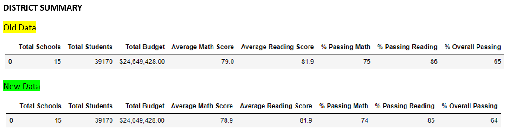
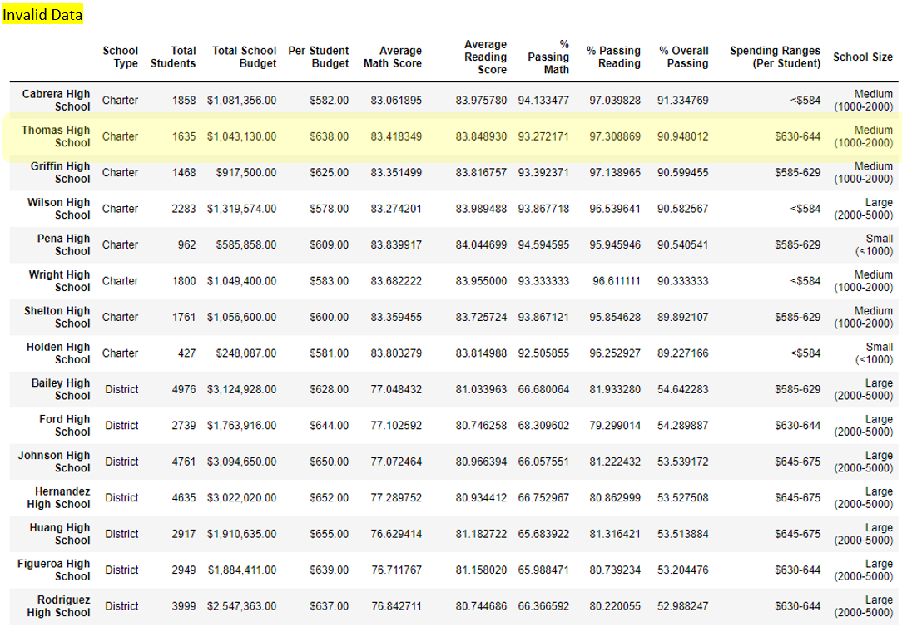
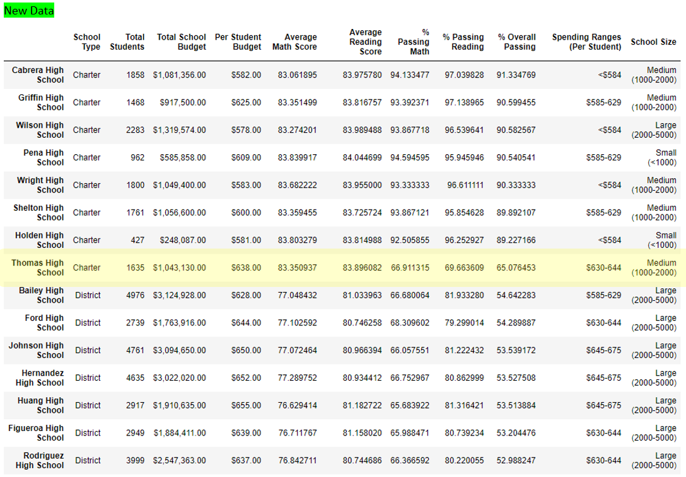
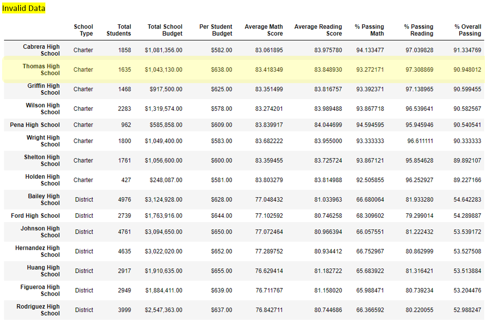
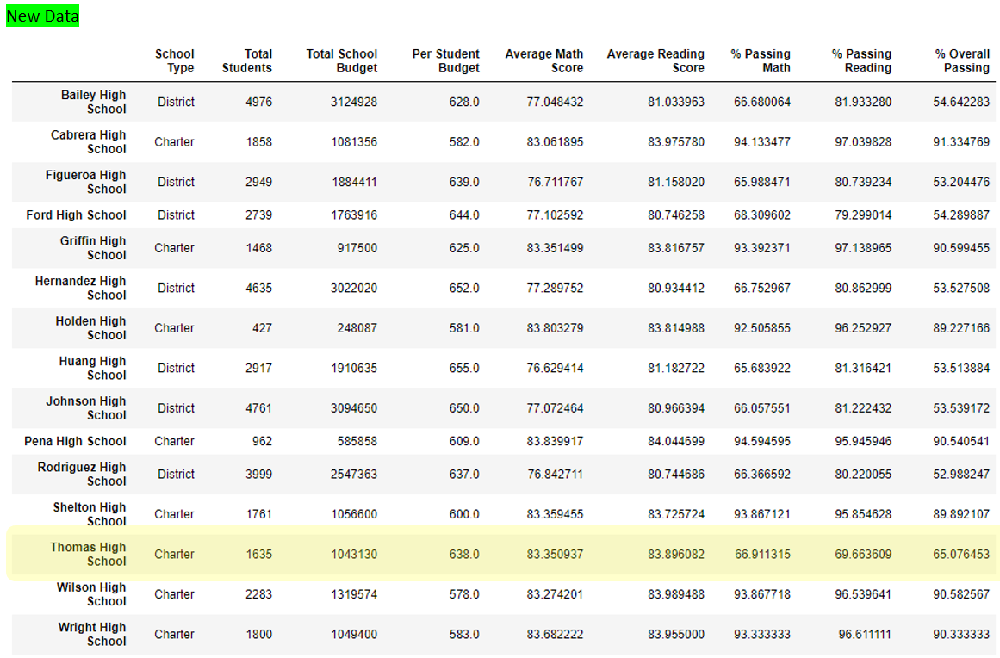
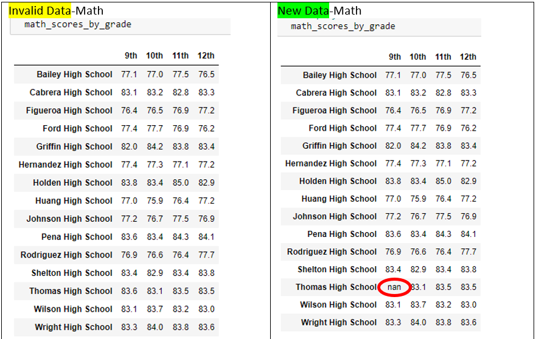
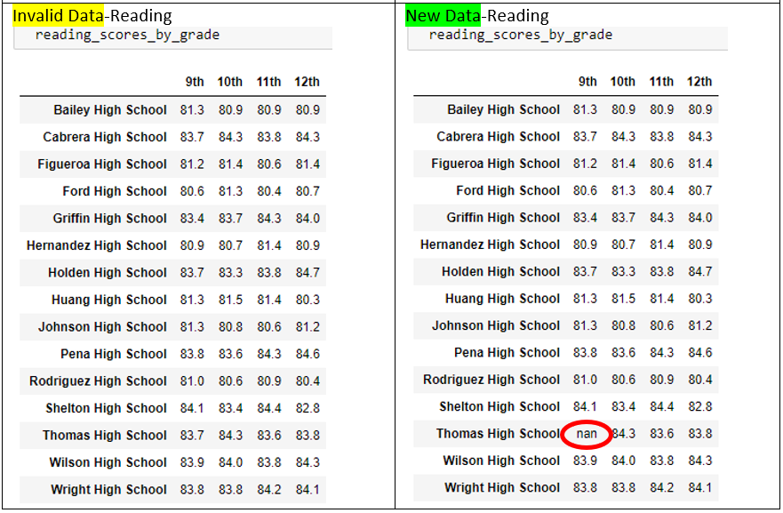
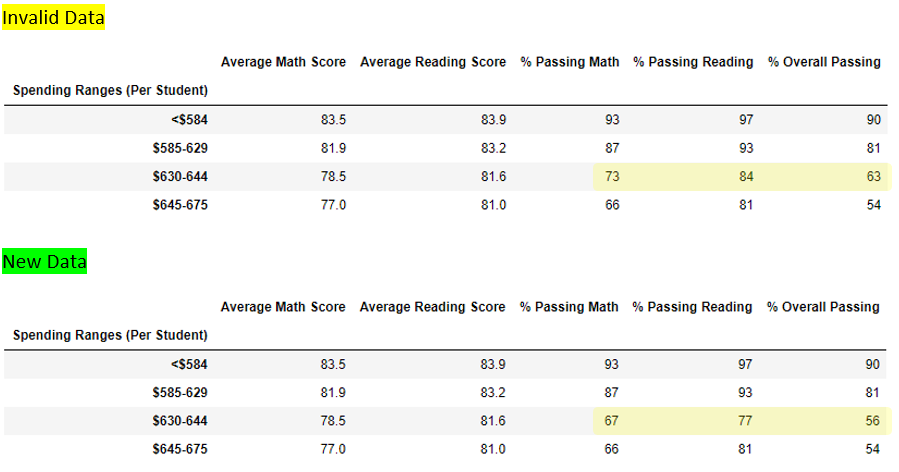
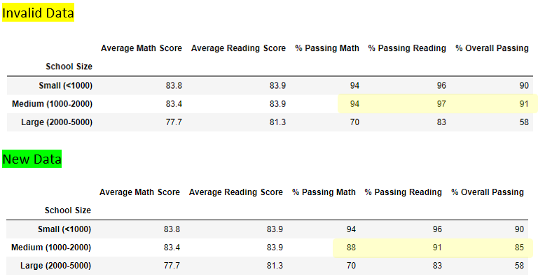
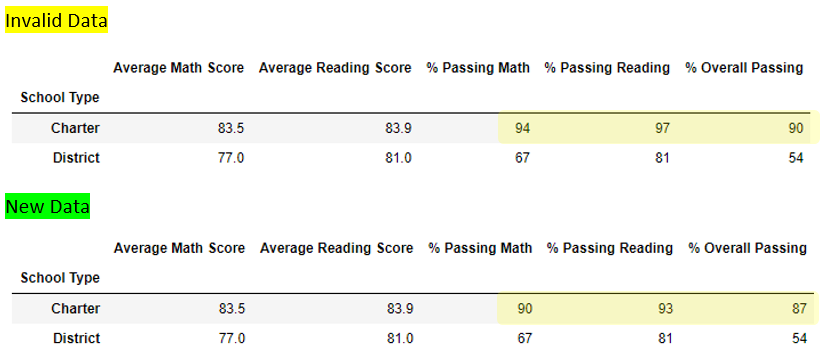

# School_District_Analysis Challenge
Module4 in Python

My Challenge approach
- Data is already clean from following the module
- subset the student data into 2 data frame: Thomas High School & all other schools
	- Use .loc on the Thomas High School subset to to replace all of the invlaid scores
	- Used drop to create the other subet with the remaining student data
- Join those 2 dataframes data into a new student dataframe
- Rerun the analysis using the new student data 

## Analysis summary
Compares results before and after updating the Thomas High School 9th grade data

## Recreate the district and school summary DataFrames.
**How is the district summary affected?**\
The impact to the overall district summary is a <1% drop in the Math, Reading & Overall passing percentages

**How is the school summary affected?**\
Shown below there is a significant impact by removing the invlaid data. Thomas HS moves from the #2 school, down to #8. The reading & overall passing percentages are reduced by 20+% each 

## Recalculate the high- and low-performing schools.

**How does replacing the ninth graders’ math and reading scores affect Thomas High School’s performance, relative to the other schools?**
- Updating the scores has resulted in a major impact Thomas's High School's ranking compared to the other schools. They have dropped from 2nd place down to 13th

## Recalculate the scores by grade, scores by school spending, scores by school size, and scores by school type.

How does replacing the ninth-grade scores affect the following?

**Scores by Grade**
- Thomas High School now loose a year's worth of data

**Scores by School Spending**
- Thomas HS is withing the $630-$644 spending bin which is where we see the impact of the grade correction by the lowering of the passing percentages for both exams

**Scores by School Size**
- Thomas HS is a medium sized school and we can see the impact of their grade correction by the lowering of the passing percentages for both exams

**Scores by School Type**
- Updating the Thomas HS data has resulted in a decrerase in the passing percentage for both exams for Charter schools.
